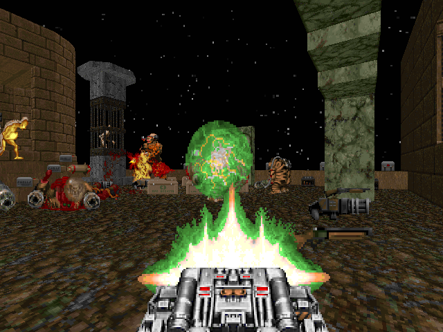

<p align="center">
      
</p>

# BFG-9k

BFG-9k is a easy to use encrypted steganography tool that can be used to embed files into into images and video. The tool currently supports embedding files into PNG and MKV files encoded with the PNG codec. It uses AES encryption to encrypt the file before embedding it into the target file. It also utilizes the Reed-Solomon error-correcting format to ensure that data can still be recovered in the event of lost bits or corruption. In the case you are encoding a file into a MKV file, the file is stored in the image data across the video frames in chunks. You may need to change the chunk size depending on the size of the stream you are embedding into.


## What is Steganography?
Image steganography is the practice of concealing information within the data of digital images without altering their visual appearance. The hidden data can include text, images, audio, or any other form of binary information. This is different from cryptography, where the goal is to secure the data from unauthorized access. Steganography is in this case used in combination with cryptography to provide an extra layer of security.

Below is a example of what steganography looks in a image. The left image is the original image, and the right image contains some hidden data. Feel free to download the image and try to extract the hidden data yourself! 

<table align="center">
      <tr>
            <td>Original</td>
            <td>Encoded</td>
      </tr>
      <tr>
            <td></td>
            <td></td>
      </tr>
</table>


## Usage

```sh
❯ ./bfg9k -h
Usage of bfg9k:
  -chunk int
        chunk size (default 768000)
  -cores int
        number of cores to use (default 32)
  -function string
        encrypt or decrypt
  -input string
        input file
  -key string
        encryption key
  -output string
        output file
  -replicas int
        number of parity shards to use for Reed-Solomon encoding (default 25)
  -shards int
        number of shards to use for Reed-Solomon encoding (default 100)
  -truncate
        truncate the output video when all data is encoded
  -type string
        png or mkv
  -victim string
        victim png or mkv
```

## Installation
To use bf9k, you will need the following dependencies:
- ffmpeg
- opencv4
- vtk
- glew
- go

On Arch Linux, you can install the dependencies with the following command:
```sh
sudo pacman -S ffmpeg opencv vtk glew go
```

## MKV Steganography 

### Encoding
Embedding a file into a MKV container is a simple process, but the main consideration is that the exported mkv will be encoded with the lossless png codec. This is because the file is stored in the image data of the video frames. 

This can be done with the following command:
```sh
./bfg9k -function encrypt -input file.txt -output file.mkv -victim video_png.mkv -key password -type mkv
```

### Decoding
To extract a file from a MKV file, run the following command:
```sh
./bfg9k -function decrypt -input file.mkv -output file.txt -key password -type mkv
```

## PNG Steganography

### Encoding
To embed a file into a png file, run the following command:
```sh
./bfg9k -function encrypt -input file.txt -output file.png -victim victim.png -key password -type png
```

### Decoding
To extract a file from a png file, run the following command:
```sh
./bfg9k -function decrypt -input file.png -output file.txt -key password -type png
```
